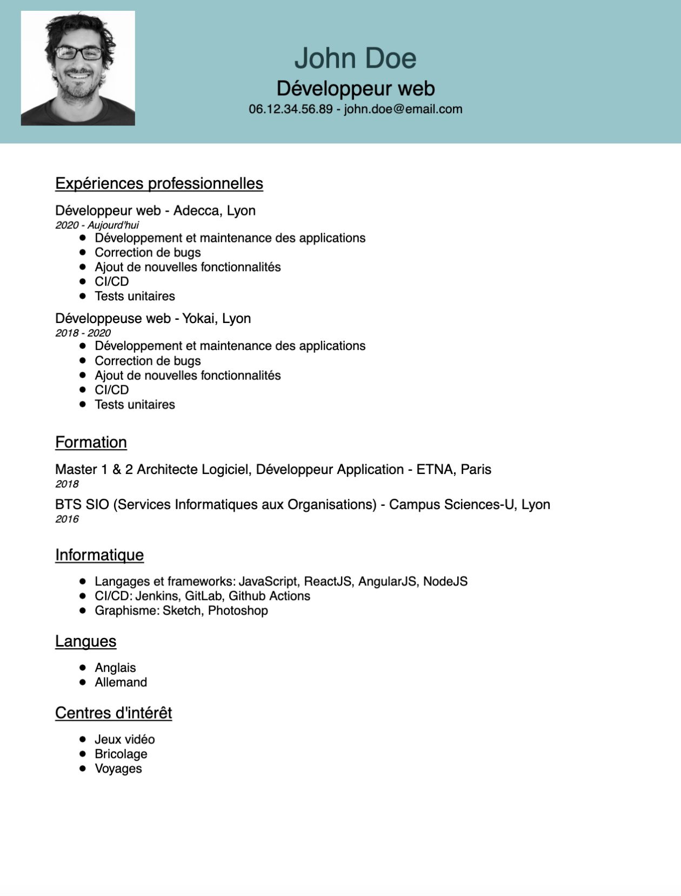

# <div style="display: flex; align-items: center;" > JEFF (JSON Editor File Format)</div>

JEFF is a smart and nice tool which allows you to edit your resume and any other anoying-to-write file.

## Getting Started
- Clone and install the project
```
git clone git@github.com:Madylune/jeff.git
cd jeff
npm install
```

### Commands
| Command | Description |
| ------  | ----------- |
| init    | Initializes a `JSON` file based on the example template |
| write   | Writes from `JSON` to `PDF` and export the file in `PDF` format |
| watch   | (Developer mode) Restarts the `write` script on each code change |

## Usage
- Create a file into `/templates/resume.json` with your data in JSON format
- Or generate one from the provided example file
```
npm run init:resume
```
- Run in the terminal to generate your resume PDF file, add the filename as argument
```
npm run write:resume <filename>
```
- Retrieve your file in the directory root

### Included templates
- [Resume]('https://github.com/Madylune/jeff/blob/main/templates/example.resume.json')
- [Recipe]('https://github.com/Madylune/jeff/blob/main/templates/example.recipe.json')

### Input
```json
{
  "name": "John Doe",
  "title": "Développeur web",
  "picture": "assets/picture.jpeg",
  "email": "john.doe@email.com",
  "phone": "06.12.34.56.89",
  "blocks": [
    {
      "title": "Expériences professionnelles",
      "blocks": [
        {
          "title": "Développeur web",
          "date": "2020 - Aujourd'hui",
          "location": "Adecca, Lyon",
          "list": [
            "Développement et maintenance des applications",
            "Correction de bugs",
            "Ajout de nouvelles fonctionnalités",
            "CI/CD",
            "Tests unitaires"
          ]
        },
        {
          "title": "Développeuse web",
          "date": "2018 - 2020",
          "location": "Yokai, Lyon",
          "list": [
            "Développement et maintenance des applications",
            "Correction de bugs",
            "Ajout de nouvelles fonctionnalités",
            "CI/CD",
            "Tests unitaires"
          ]
        }
      ]
    },
    {
      "title": "Formation",
      "blocks": [
        {
          "title": "Master 1 & 2 Architecte Logiciel, Développeur Application",
          "date": "2018",
          "location": "ETNA, Paris"
        },
        {
          "title": "BTS SIO (Services Informatiques aux Organisations)",
          "date": "2016",
          "location": "Campus Sciences-U, Lyon"
        }
      ]
    },
    {
      "title": "Informatique",
      "list": [
        "Langages et frameworks: JavaScript, ReactJS, AngularJS, NodeJS",
        "CI/CD: Jenkins, GitLab, Github Actions",
        "Graphisme: Sketch, Photoshop"
      ]
    },
    {
      "title": "Langues",
      "list": [
        "Anglais",
        "Allemand"
      ]
    },
    {
      "title": "Centres d'intérêt",
      "list": [
        "Jeux vidéo",
        "Bricolage",
        "Voyages"
      ]
    }
  ]
}
```

### Output


## Licence
Available under the [MIT license](https://opensource.org/license/mit/).